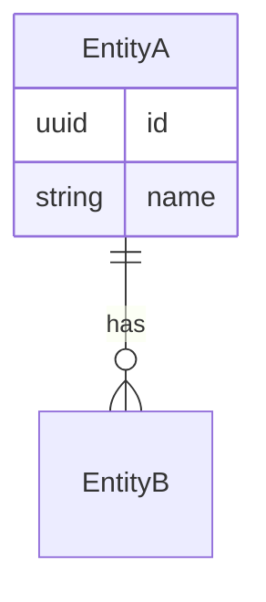

# PRD: [Feature Name]

**Status:** Draft | In Review | Approved | Superseded  
**Author:** [Name or agent]  
**Date:** YYYY-MM-DD  
**Epic:** #[issue number] (if applicable)

---

## Problem

[What problem does this solve, and for whom? Be specific about the user and the situation.]

## Goals

- [ ] [Measurable outcome 1]
- [ ] [Measurable outcome 2]

## Non-goals

- [Explicitly out of scope — be as specific as the goals]

## User stories

- As a [user type], I want to [action] so that [outcome]
- As a [user type], I want to [action] so that [outcome]

## Domain model changes

[New entities, modified relationships. Use a Mermaid diagram if helpful.]

## API changes (high level)

| Method | Path | Description |
|---|---|---|
| POST | /v1/resource | Create a new resource |
| GET | /v1/resource/:id | Get a resource by ID |

[Full spec will be written as a separate PR — this is intent only]

## UI/UX notes

[Key screens or flows, links to design files if available]

## Open questions

- [ ] [Question that needs a decision before implementation]
- [ ] [Question that needs a decision before implementation]

## Success criteria

[How will we know this feature is working correctly in production?]
